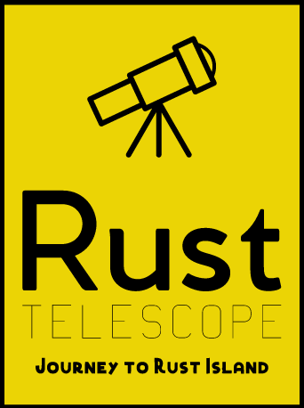

<!-- AUTO-GENERATED-CONTENT:START (STARTER) -->
<p align="center">
  <a href="https://rust-telescope.live">
    
  </a>
</p>

<h1 align="center">
  Rust Telescope
</h1>

[](https://app.netlify.com/sites/rust-telescope/deploys)

[](https://GitHub.com/tnkemdilim/rust-telescope.live/issues/)
[](https://github.com/tnkemdilim/rust-telescope.live/blob/master/LICENSE)

A bi-weekly and monthly video cast focused on:

- Teaching Rust basics.
- Discussing industry use-cases and best practices.
- Building real-life product and tools in Rust.
- Insightful interviews with Rustaceans.

## 🚀 Contributing

The official website was built using [Gatsby](https://www.gatsbyjs.org/).

1.  **Clone The Repository.**

    Cloning the repo, pulls the source from the remote to local.

    ```sh
    git clone https://github.com/TNkemdilim/rust-telescope.live.git
    ```

1.  **Install Gatsby CLI.**

    To contribute, it is required that you have [Gatsby CLI](https://www.gatsbyjs.org/docs/quick-start) installed. You could check out the their [documentation](https://www.gatsbyjs.org/docs/) to find out more.

1.  **Start developing.**

    Navigate into your rust telescope's directory and start it up.

    ```sh
    cd rust-telescope/
    gatsby develop
    ```

1.  **Open the source code and start editing!**

    Rust Telescope is now running at `http://localhost:8000`!

    _Note: You'll also see a second link: _`http://localhost:8000/___graphql`\_. This is a tool you can use to experiment with querying your data. Learn more about using this tool in the [Gatsby tutorial](https://www.gatsbyjs.org/tutorial/part-five/#introducing-graphiql).

## 💫 Deploy

[](https://app.netlify.com/start/deploy?repository=https://github.com/gatsbyjs/gatsby-starter-hello-world)
